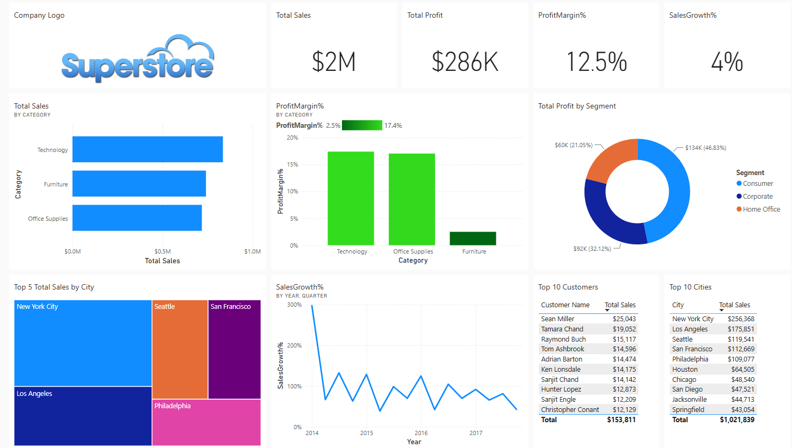
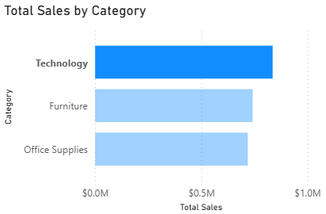
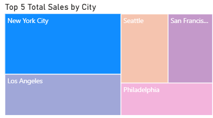
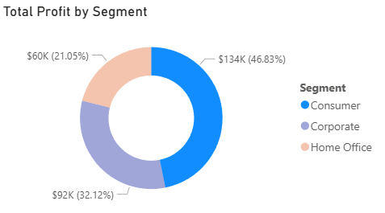
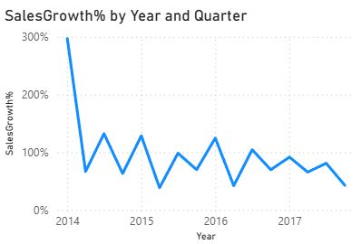
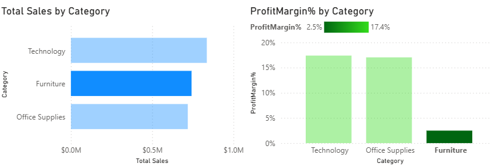

# Sales analysis of Supermarket data using PowerBI
---
# Overview:
This project analyzes sales data from the supermarket dataset, exploring revenue, profit margin, and customer insights through the use of interactive PowerBI Dashboard.

# Dataset used:

Dataset Kaggle link: https://www.kaggle.com/datasets/vivek468/superstore-dataset-final

The dataset contains 9995 rows and 21 columns, and it contains information about the each transactions and orders with the customers. Some relevant columns in the dataset are sales, profit, customer name, city, category and order date.

# Process:
- Exploring/cleaning the data
- Visualization of data
- Adding measures
- Creating a dashboard

# Key Findings:
- Technology category generated the highest revenue.
- New York City was the highest spending city.
- Consumer class were the most popular customers.
- The sales growth was fluctuating through out the years.
- Despite the high revenue of Furniture category, the profit margin was low.

# Dashboard Preview:

# Tools Used:
- PowerBI
- DAX
